# 🧇 Waffles Application Flows Documentation

Complete technical documentation of all user journeys, system flows, and interactions within the Waffles trivia platform.

---

## Table of Contents

1. [Architecture Overview](#architecture-overview)
2. [User Onboarding Flow](#user-onboarding-flow)
3. [Referral System Flow](#referral-system-flow)
4. [Game Lifecycle](#game-lifecycle)
5. [Ticket Purchase Flow](#ticket-purchase-flow)
6. [Game Join Flow](#game-join-flow)
7. [Live Gameplay Flow](#live-gameplay-flow)
8. [Real-Time Events (SSE)](#real-time-events-sse)
9. [Reward System Flow](#reward-system-flow)
10. [Database Schema Relationships](#database-schema-relationships)

---

## Architecture Overview

```mermaid
graph TB
    subgraph "Client Layer"
        UI[Next.js Pages]
        Hooks[React Hooks]
        Components[UI Components]
    end

    subgraph "API Layer"
        Actions[Server Actions]
        SSE[SSE Endpoints]
        Routes[API Routes]
    end

    subgraph "Data Layer"
        Prisma[Prisma Client]
        Adapter[@prisma/adapter-pg]
        DB[(PostgreSQL)]
    end

    subgraph "External Services"
        Farcaster[Farcaster API]
        Neynar[Neynar SDK]
        USDC[USDC Payments]
    end

    UI --> Hooks
    Hooks --> Actions
    Components --> Actions
    UI --> SSE
    Actions --> Prisma
    Routes --> Prisma
    SSE --> Prisma
    Prisma --> Adapter
    Adapter --> DB
    Actions --> Farcaster
    Actions --> Neynar
    Actions --> USDC
```

**Key Technologies:**

- **Frontend**: Next.js 16 (App Router), React 19
- **Backend**: Server Actions, SSE for real-time
- **Database**: PostgreSQL 17 + Prisma v7
- **Auth**: Farcaster MiniKit
- **Payments**: USDC on Base

---

## User Onboarding Flow

### Overview

New users authenticate via Farcaster and receive a unique invite code. Users can be in different statuses: NONE, WAITLIST, ACTIVE, or BANNED.

### Flow Diagram

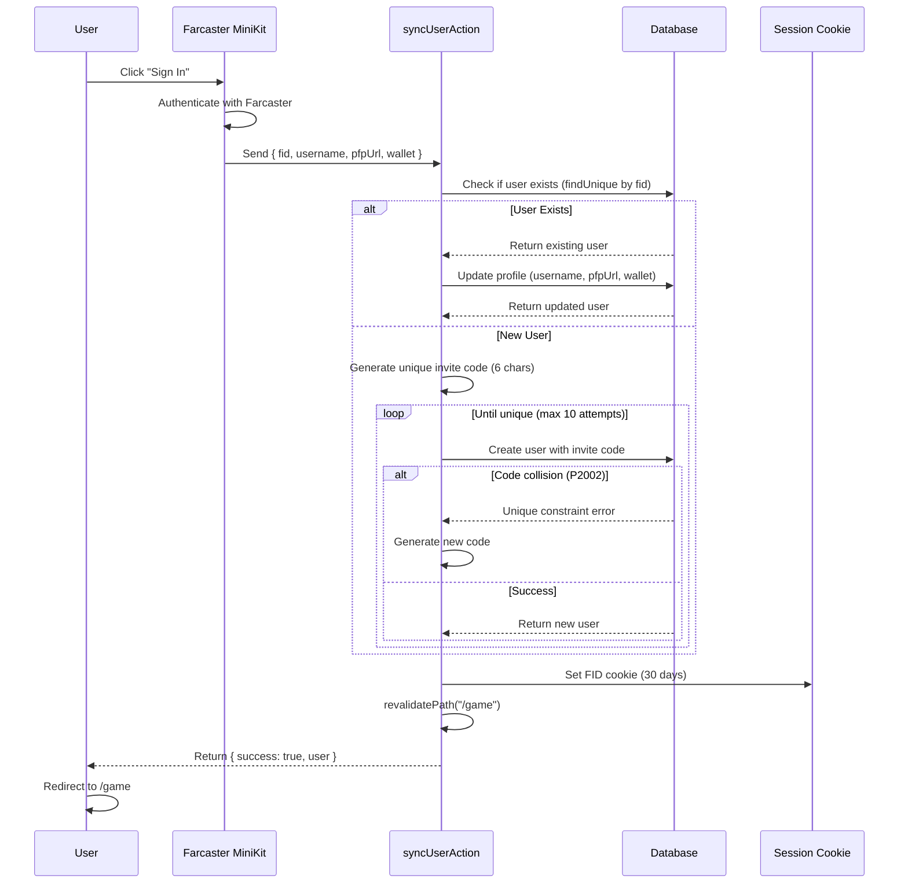
```mermaid
sequenceDiagram
    participant User
    participant MiniKit as Farcaster MiniKit
    participant Action as syncUserAction
    participant DB as Database
    participant Cookie as Session Cookie

    User->>MiniKit: Click "Sign In"
    MiniKit->>MiniKit: Authenticate with Farcaster
    MiniKit->>Action: Send { fid, username, pfpUrl, wallet }

    Action->>DB: Check if user exists (findUnique by fid)

    alt User Exists
        DB-->>Action: Return existing user
        Action->>DB: Update profile (username, pfpUrl, wallet)
        DB-->>Action: Return updated user
    else New User
        Action->>Action: Generate unique invite code (6 chars)
        loop Until unique (max 10 attempts)
            Action->>DB: Create user with invite code
            alt Code collision (P2002)
                DB-->>Action: Unique constraint error
                Action->>Action: Generate new code
            else Success
                DB-->>Action: Return new user
            end
        end
    end

    Action->>Cookie: Set FID cookie (30 days)
    Action->>Action: revalidatePath("/game")
    Action-->>User: Return { success: true, user }
    User->>User: Redirect to /game
```

### State Machine

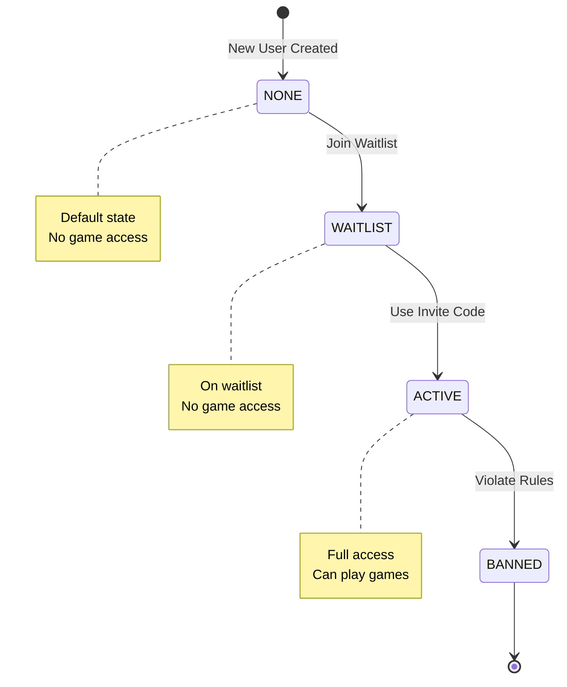
```mermaid
stateDiagram-v2
    [*] --> NONE: New User Created
    NONE --> WAITLIST: Join Waitlist
    WAITLIST --> ACTIVE: Use Invite Code
    ACTIVE --> BANNED: Violate Rules
    BANNED --> [*]

    note right of NONE
        Default state
        No game access
    end note

    note right of WAITLIST
        On waitlist
        No game access
    end note

    note right of ACTIVE
        Full access
        Can play games
    end note
```

### Database Interactions

**syncUserAction** performs:

1. `user.findUnique({ where: { fid } })` - Check existence
2. If exists: `user.update()` - Update profile
3. If new: `user.create()` - Create with invite code
4. Cookie: `cookies().set("fid", ...)` - Store session

### Key Files

- [`src/actions/onboarding.ts`](file:///Users/ChukwukaUba/Desktop/waffles/frontend/src/actions/onboarding.ts) - Main logic
- [`src/lib/schemas.ts`](file:///Users/ChukwukaUba/Desktop/waffles/frontend/src/lib/schemas.ts) - Validation schemas

---

## Referral System Flow

### Overview

Users receive an invite code upon registration. When a new user uses this code to activate their account, the inviter receives rewards.

### Flow Diagram

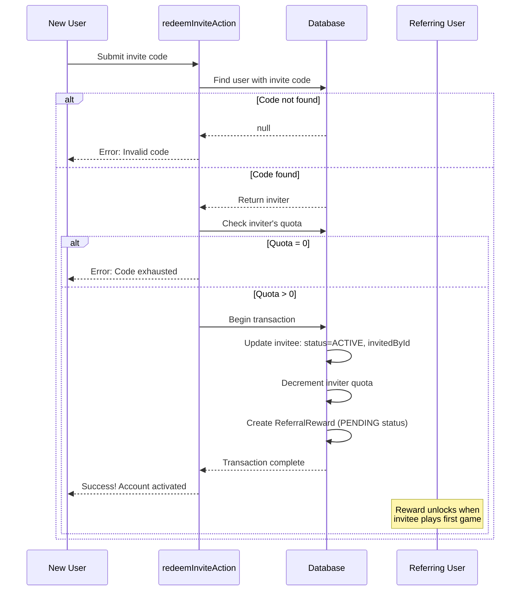
```mermaid
sequenceDiagram
    participant Invitee as New User
    participant Action as redeemInviteAction
    participant DB as Database
    participant Inviter as Referring User

    Invitee->>Action: Submit invite code
    Action->>DB: Find user with invite code

    alt Code not found
        DB-->>Action: null
        Action-->>Invitee: Error: Invalid code
    else Code found
        DB-->>Action: Return inviter
        Action->>DB: Check inviter's quota

        alt Quota = 0
            Action-->>Invitee: Error: Code exhausted
        else Quota > 0
            Action->>DB: Begin transaction

            DB->>DB: Update invitee: status=ACTIVE, invitedById
            DB->>DB: Decrement inviter quota
            DB->>DB: Create ReferralReward (PENDING status)

            DB-->>Action: Transaction complete
            Action-->>Invitee: Success! Account activated

            Note over Inviter: Reward unlocks when<br/>invitee plays first game
        end
    end
```

### Referral Reward States

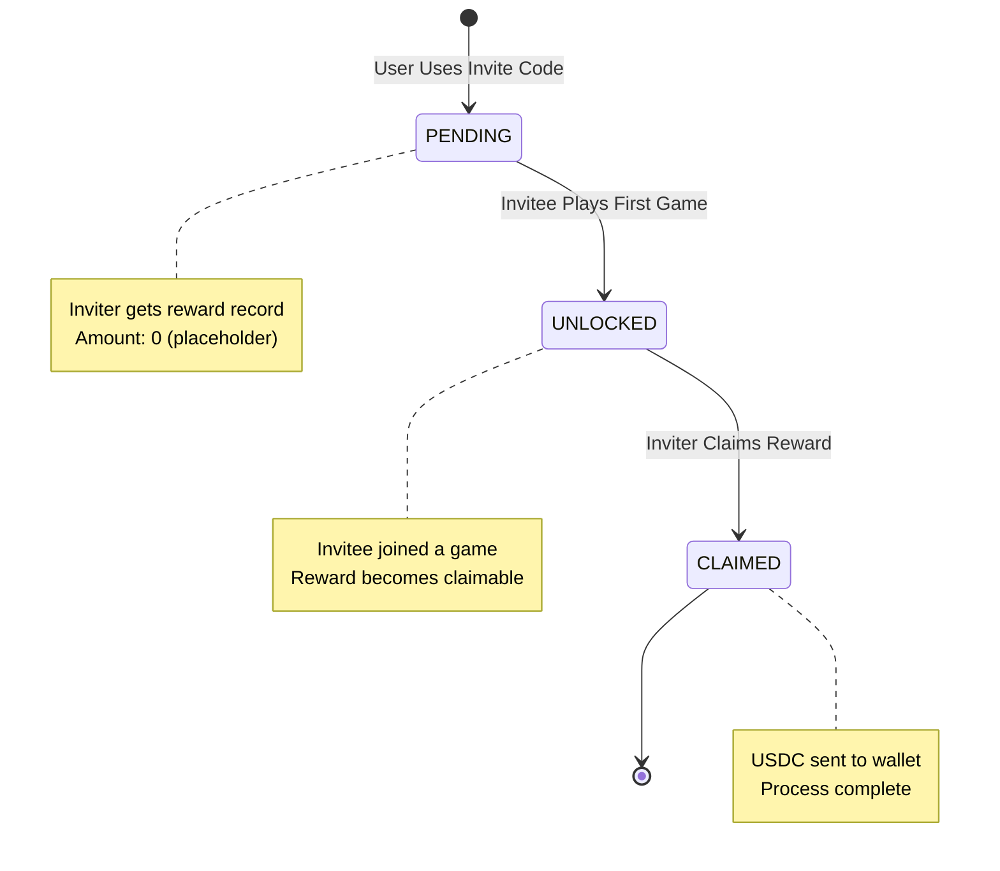
```mermaid
stateDiagram-v2
    [*] --> PENDING: User Uses Invite Code
    PENDING --> UNLOCKED: Invitee Plays First Game
    UNLOCKED --> CLAIMED: Inviter Claims Reward
    CLAIMED --> [*]

    note right of PENDING
        Inviter gets reward record
        Amount: 0 (placeholder)
    end note

    note right of UNLOCKED
        Invitee joined a game
        Reward becomes claimable
    end note

    note right of CLAIMED
        USDC sent to wallet
        Process complete
    end note
```

### Database Schema

```prisma
model ReferralReward {
  id         Int          @id @default(autoincrement())
  inviter    User         @relation("InviterRewards", fields: [inviterId], references: [id])
  inviterId  Int
  inviteeId  Int          @unique  // One reward per invitee
  status     RewardStatus @default(PENDING)
  amount     Int          @default(0)
  createdAt  DateTime     @default(now())
  unlockedAt DateTime?    // When invitee played first game
}
```

### Key Files

- [`src/actions/waitlist.ts`](file:///Users/ChukwukaUba/Desktop/waffles/frontend/src/actions/waitlist.ts) - Invite redemption
- [`prisma/schema.prisma`](file:///Users/ChukwukaUba/Desktop/waffles/frontend/prisma/schema.prisma) - Data model

---

## Game Lifecycle

### Overview

Games move through distinct states from creation to completion. Only SCHEDULED games can accept new players.

### State Machine

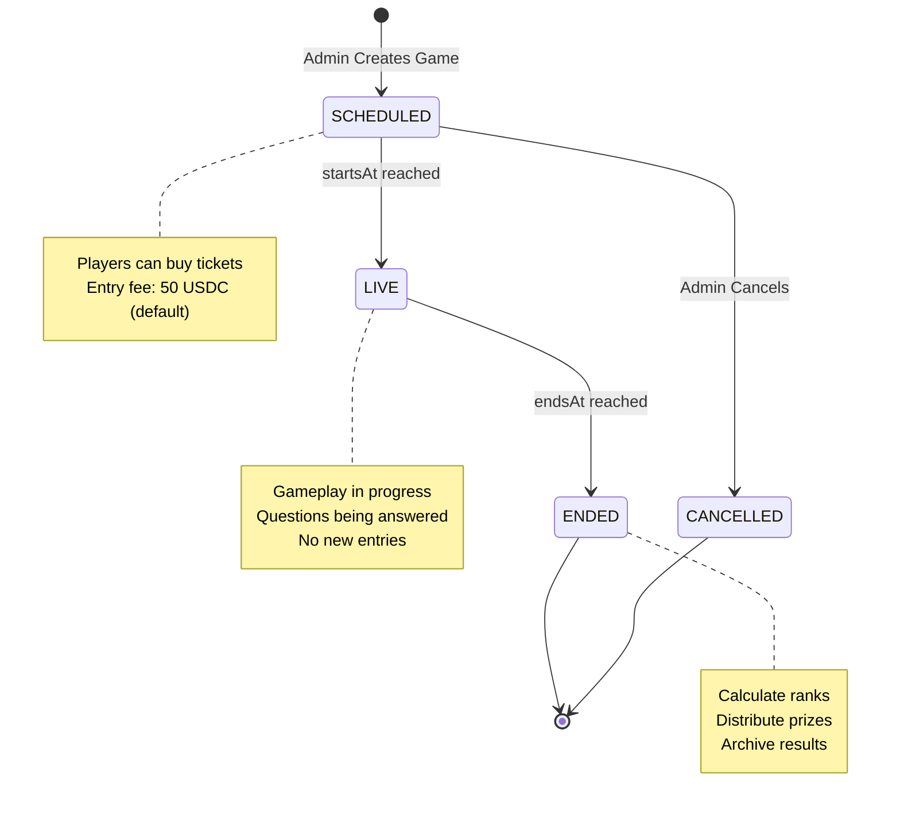
```mermaid
stateDiagram-v2
    [*] --> SCHEDULED: Admin Creates Game
    SCHEDULED --> LIVE: startsAt reached
    LIVE --> ENDED: endsAt reached
    SCHEDULED --> CANCELLED: Admin Cancels
    ENDED --> [*]
    CANCELLED --> [*]

    note right of SCHEDULED
        Players can buy tickets
        Entry fee: 50 USDC (default)
    end note

    note right of LIVE
        Gameplay in progress
        Questions being answered
        No new entries
    end note

    note right of ENDED
        Calculate ranks
        Distribute prizes
        Archive results
    end note
```

### Game Database Structure

```prisma
model Game {
  id               Int        @id @default(autoincrement())
  title            String
  description      String?
  theme            GameTheme
  status           GameStatus @default(SCHEDULED)

  // Timing
  startsAt         DateTime
  endsAt           DateTime

  // Configuration
  entryFee         Int        @default(50)
  prizePool        Int        @default(0)
  roundDurationSec Int        @default(15)
  questionCount    Int        @default(9)
  maxPlayers       Int        @default(200)

  // Relations
  questions        Question[]
  tickets          Ticket[]
  players          GamePlayer[]
  answers          Answer[]
  chats            Chat[]
}
```

### Game Creation Process

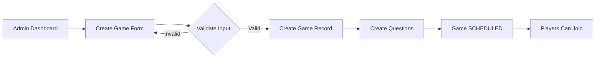
```mermaid
flowchart LR
    A[Admin Dashboard] --> B[Create Game Form]
    B --> C{Validate Input}
    C -->|Invalid| B
    C -->|Valid| D[Create Game Record]
    D --> E[Create Questions]
    E --> F[Game SCHEDULED]
    F --> G[Players Can Join]
```

### Key Files

- [`scripts/seed-game.ts`](file:///Users/ChukwukaUba/Desktop/waffles/frontend/scripts/seed-game.ts) - Game seeding
- [`scripts/game-data.ts`](file:///Users/ChukwukaUba/Desktop/waffles/frontend/scripts/game-data.ts) - Question data

---

## Ticket Purchase Flow

### Overview

Users purchase entry to games using USDC. Tickets represent paid access and are redeemed when joining gameplay.

### Flow Diagram

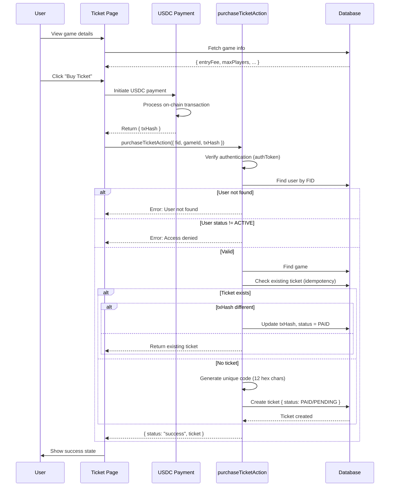
```mermaid
sequenceDiagram
    participant User
    participant UI as Ticket Page
    participant Pay as USDC Payment
    participant Action as purchaseTicketAction
    participant DB as Database

    User->>UI: View game details
    UI->>DB: Fetch game info
    DB-->>UI: { entryFee, maxPlayers, ... }

    User->>UI: Click "Buy Ticket"
    UI->>Pay: Initiate USDC payment
    Pay->>Pay: Process on-chain transaction
    Pay-->>UI: Return { txHash }

    UI->>Action: purchaseTicketAction({ fid, gameId, txHash })

    Action->>Action: Verify authentication (authToken)
    Action->>DB: Find user by FID

    alt User not found
        Action-->>UI: Error: User not found
    else User status != ACTIVE
        Action-->>UI: Error: Access denied
    else Valid
        Action->>DB: Find game
        Action->>DB: Check existing ticket (idempotency)

        alt Ticket exists
            alt txHash different
                Action->>DB: Update txHash, status = PAID
            else
                Action-->>UI: Return existing ticket
            end
        else No ticket
            Action->>Action: Generate unique code (12 hex chars)
            Action->>DB: Create ticket { status: PAID/PENDING }
            DB-->>Action: Ticket created
        end

        Action-->>UI: { status: "success", ticket }
    end

    UI->>User: Show success state
```

### Ticket States

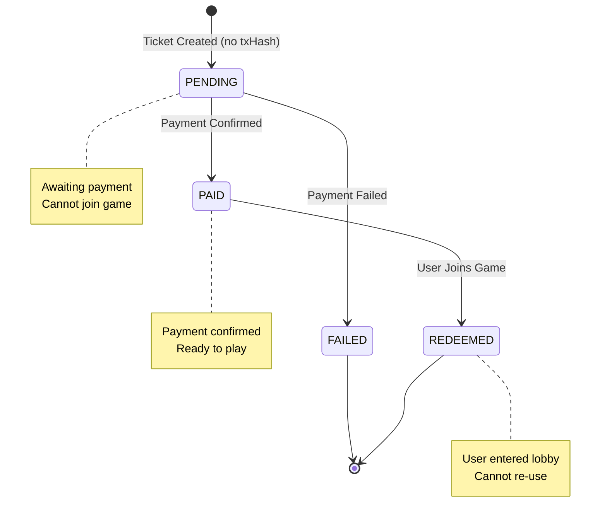
```mermaid
stateDiagram-v2
    [*] --> PENDING: Ticket Created (no txHash)
    PENDING --> PAID: Payment Confirmed
    PENDING --> FAILED: Payment Failed
    PAID --> REDEEMED: User Joins Game
    FAILED --> [*]
    REDEEMED --> [*]

    note right of PENDING
        Awaiting payment
        Cannot join game
    end note

    note right of PAID
        Payment confirmed
        Ready to play
    end note

    note right of REDEEMED
        User entered lobby
        Cannot re-use
    end note
```

### Idempotency Handling

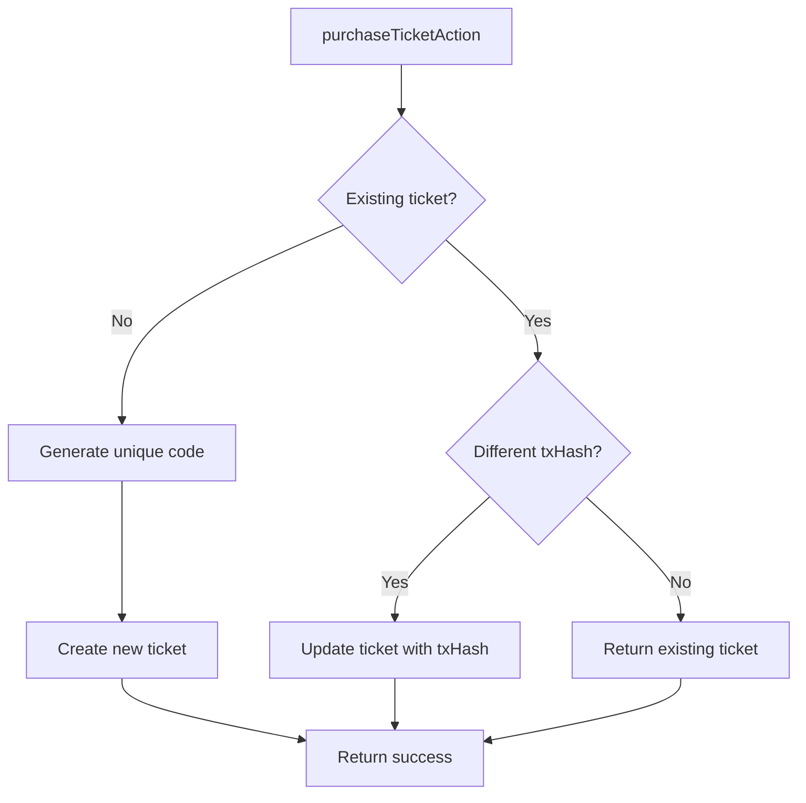
```mermaid
flowchart TD
    A[purchaseTicketAction] --> B{Existing ticket?}
    B -->|No| C[Generate unique code]
    C --> D[Create new ticket]
    B -->|Yes| E{Different txHash?}
    E -->|Yes| F[Update ticket with txHash]
    E -->|No| G[Return existing ticket]
    D --> H[Return success]
    F --> H
    G --> H
```

### Database Interactions

```typescript
// 1. Check existing ticket
const existingTicket = await prisma.ticket.findUnique({
  where: { gameId_userId: { gameId, userId } },
});

// 2. Create new ticket
const newTicket = await prisma.ticket.create({
  data: {
    userId,
    gameId,
    amountUSDC: game.entryFee,
    code: generateUniqueCode(),
    txHash: txHash ?? null,
    status: txHash ? "PAID" : "PENDING",
  },
});
```

### Key Files

- [`src/actions/ticket.ts`](file:///Users/ChukwukaUba/Desktop/waffles/frontend/src/actions/ticket.ts) - Purchase logic
- [`src/app/(platform)/game/[gameId]/ticket/page.tsx`](<file:///Users/ChukwukaUba/Desktop/waffles/frontend/src/app/(platform)/game/[gameId]/ticket/page.tsx>) - UI

---

## Game Join Flow

### Overview

After purchasing a ticket, users join the game lobby. This creates a `GamePlayer` record and redeems the ticket.

### Flow Diagram

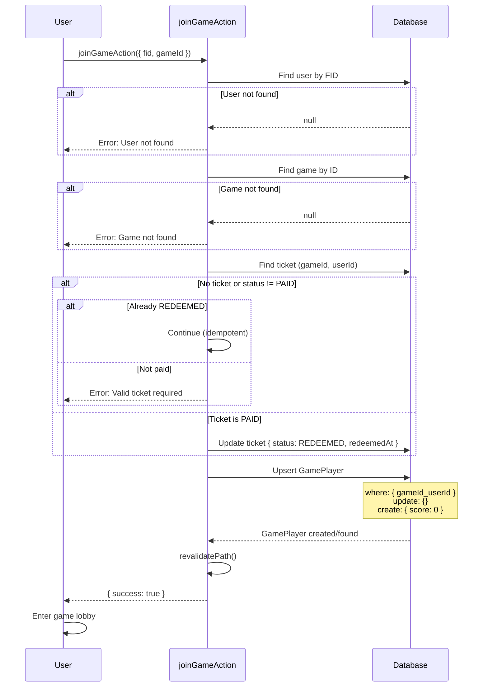
```mermaid
sequenceDiagram
    participant User
    participant Action as joinGameAction
    participant DB as Database

    User->>Action: joinGameAction({ fid, gameId })

    Action->>DB: Find user by FID
    alt User not found
        DB-->>Action: null
        Action-->>User: Error: User not found
    end

    Action->>DB: Find game by ID
    alt Game not found
        DB-->>Action: null
        Action-->>User: Error: Game not found
    end

    Action->>DB: Find ticket (gameId, userId)

    alt No ticket or status != PAID
        alt Already REDEEMED
            Action->>Action: Continue (idempotent)
        else Not paid
            Action-->>User: Error: Valid ticket required
        end
    else Ticket is PAID
        Action->>DB: Update ticket { status: REDEEMED, redeemedAt }
    end

    Action->>DB: Upsert GamePlayer
    Note over DB: where: { gameId_userId }<br/>update: {}<br/>create: { score: 0 }

    DB-->>Action: GamePlayer created/found
    Action->>Action: revalidatePath()
    Action-->>User: { success: true }

    User->>User: Enter game lobby
```

### GamePlayer Creation

```prisma
model GamePlayer {
  id           Int       @id @default(autoincrement())
  game         Game      @relation(fields: [gameId], references: [id])
  gameId       Int
  user         User      @relation(fields: [userId], references: [id])
  userId       Int

  score        Int       @default(0)
  rank         Int?      // Null until game ends
  isEliminated Boolean   @default(false)
  joinedAt     DateTime  @default(now())
  claimedAt    DateTime? // When prize was claimed

  @@unique([gameId, userId])
  @@index([gameId, score(sort: Desc)])
}
```

### Join vs Leave

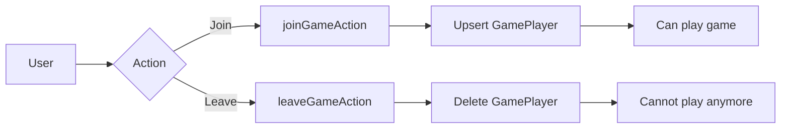
```mermaid
flowchart LR
    A[User] --> B{Action}
    B -->|Join| C[joinGameAction]
    B -->|Leave| D[leaveGameAction]
    C --> E[Upsert GamePlayer]
    D --> F[Delete GamePlayer]
    E --> G[Can play game]
    F --> H[Cannot play anymore]
```

### Key Files

- [`src/actions/game.ts`](file:///Users/ChukwukaUba/Desktop/waffles/frontend/src/actions/game.ts) - Join/leave logic

---

## Live Gameplay Flow

### Overview

During live gameplay, users answer questions within a time limit. Scores are calculated based on correctness and speed.

### Complete Gameplay Flow

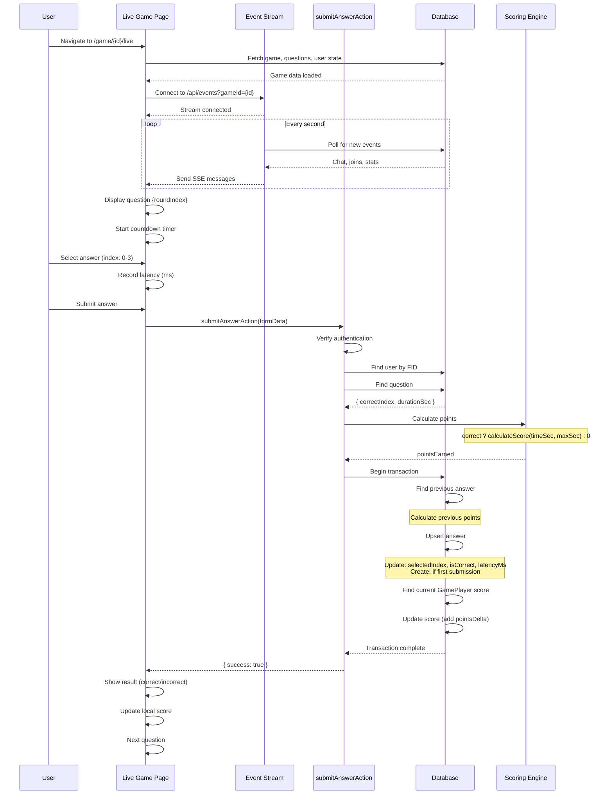
```mermaid
sequenceDiagram
    participant User
    participant UI as Live Game Page
    participant SSE as Event Stream
    participant Action as submitAnswerAction
    participant DB as Database
    participant Score as Scoring Engine

    User->>UI: Navigate to /game/{id}/live
    UI->>DB: Fetch game, questions, user state
    DB-->>UI: Game data loaded

    UI->>SSE: Connect to /api/events?gameId={id}
    SSE-->>UI: Stream connected

    loop Every second
        SSE->>DB: Poll for new events
        DB-->>SSE: Chat, joins, stats
        SSE-->>UI: Send SSE messages
    end

    UI->>UI: Display question {roundIndex}
    UI->>UI: Start countdown timer

    User->>UI: Select answer (index: 0-3)
    UI->>UI: Record latency (ms)

    User->>UI: Submit answer
    UI->>Action: submitAnswerAction(formData)

    Action->>Action: Verify authentication
    Action->>DB: Find user by FID
    Action->>DB: Find question
    DB-->>Action: { correctIndex, durationSec }

    Action->>Score: Calculate points
    Note over Score: correct ? calculateScore(timeSec, maxSec) : 0
    Score-->>Action: pointsEarned

    Action->>DB: Begin transaction

    DB->>DB: Find previous answer
    Note over DB: Calculate previous points

    DB->>DB: Upsert answer
    Note over DB: Update: selectedIndex, isCorrect, latencyMs<br/>Create: if first submission

    DB->>DB: Find current GamePlayer score
    DB->>DB: Update score (add pointsDelta)

    DB-->>Action: Transaction complete
    Action-->>UI: { success: true }

    UI->>UI: Show result (correct/incorrect)
    UI->>UI: Update local score
    UI->>UI: Next question
```

### Answer Scoring Logic

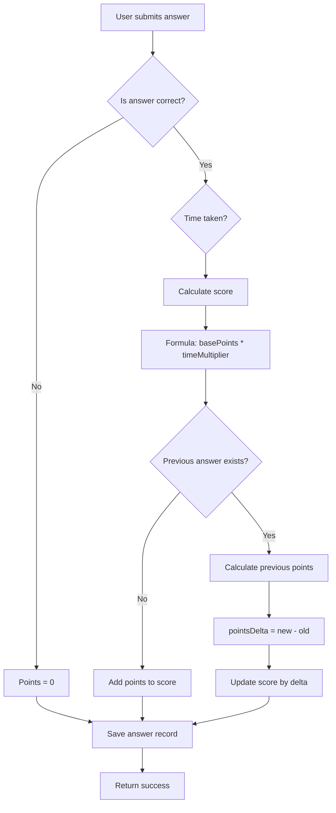
```mermaid
flowchart TD
    A[User submits answer] --> B{Is answer correct?}
    B -->|No| C[Points = 0]
    B -->|Yes| D{Time taken?}
    D --> E[Calculate score]
    E --> F[Formula: basePoints * timeMultiplier]
    F --> G{Previous answer exists?}
    G -->|No| H[Add points to score]
    G -->|Yes| I[Calculate previous points]
    I --> J[pointsDelta = new - old]
    J --> K[Update score by delta]
    C --> L[Save answer record]
    H --> L
    K --> L
    L --> M[Return success]
```

### Score Calculation

```typescript
// lib/scoring.ts
export function calculateScore(
  timeTakenSec: number,
  maxTimeSec: number
): number {
  const BASE_POINTS = 1000;
  const timeRatio = Math.max(0, (maxTimeSec - timeTakenSec) / maxTimeSec);
  return Math.floor(BASE_POINTS * timeRatio);
}
```

**Examples:**

- Answer in 1s (max 10s): `1000 * (10-1)/10 = 900 points`
- Answer in 5s (max 10s): `1000 * (10-5)/10 = 500 points`
- Answer in 10s (max 10s): `1000 * (10-10)/10 = 0 points`
- Wrong answer: `0 points` (regardless of time)

### Answer Resubmission

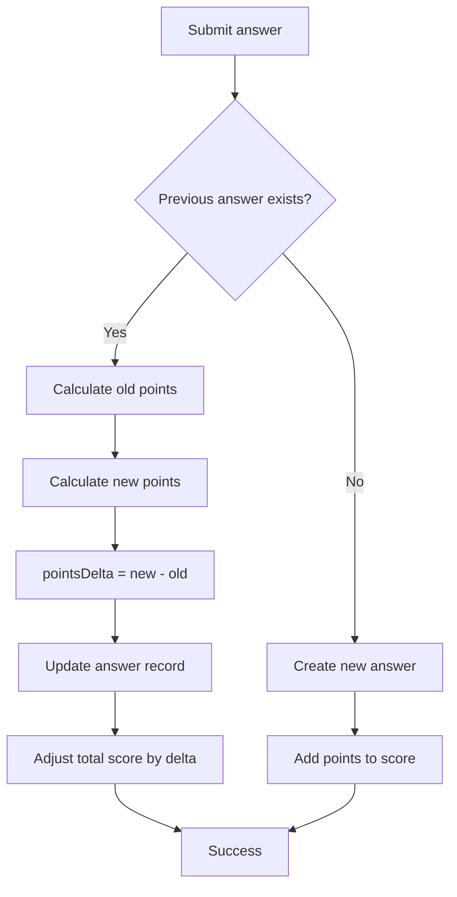
```mermaid
flowchart TD
    A[Submit answer] --> B{Previous answer exists?}
    B -->|No| C[Create new answer]
    B -->|Yes| D[Calculate old points]
    D --> E[Calculate new points]
    E --> F[pointsDelta = new - old]
    F --> G[Update answer record]
    G --> H[Adjust total score by delta]
    C --> I[Add points to score]
    H --> J[Success]
    I --> J
```

### Database Transaction

```typescript
await prisma.$transaction(async (tx) => {
  // 1. Get previous answer
  const previousAnswer = await tx.answer.findUnique({
    where: { userId_questionId: { userId, questionId } },
  });

  // 2. Calculate previous points
  const previousPoints = previousAnswer?.isCorrect
    ? calculateScore(previousAnswer.latencyMs / 1000, maxTimeSec)
    : 0;

  // 3. Upsert new answer
  await tx.answer.upsert({
    where: { userId_questionId: { userId, questionId } },
    update: { selectedIndex, isCorrect, latencyMs, pointsEarned },
    create: {
      userId,
      gameId,
      questionId,
      selectedIndex,
      isCorrect,
      latencyMs,
      pointsEarned,
    },
  });

  // 4. Update total score
  const pointsDelta = newPoints - previousPoints;
  await tx.gamePlayer.update({
    where: { gameId_userId: { gameId, userId } },
    data: { score: { increment: pointsDelta } },
  });
});
```

### Key Files

- [`src/actions/game.ts`](file:///Users/ChukwukaUba/Desktop/waffles/frontend/src/actions/game.ts#L27-L264) - Answer submission
- [`src/lib/scoring.ts`](file:///Users/ChukwukaUba/Desktop/waffles/frontend/src/lib/scoring.ts) - Score calculation
- [`src/app/(platform)/game/[gameId]/live/page.tsx`](<file:///Users/ChukwukaUba/Desktop/waffles/frontend/src/app/(platform)/game/[gameId]/live/page.tsx>) - UI

---

## Real-Time Events (SSE)

### Overview

Server-Sent Events provide real-time updates for chat messages, player joins, and game statistics without WebSockets.

### SSE Connection Flow

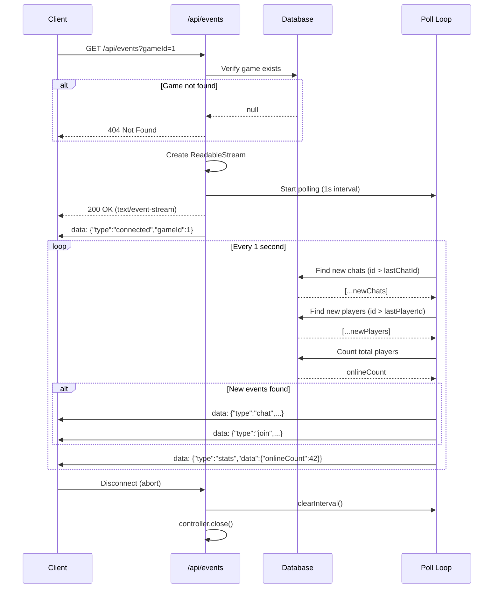
```mermaid
sequenceDiagram
    participant Client
    participant SSE as /api/events
    participant DB as Database
    participant Poller as Poll Loop

    Client->>SSE: GET /api/events?gameId=1
    SSE->>DB: Verify game exists
    alt Game not found
        DB-->>SSE: null
        SSE-->>Client: 404 Not Found
    end

    SSE->>SSE: Create ReadableStream
    SSE->>Poller: Start polling (1s interval)
    SSE-->>Client: 200 OK (text/event-stream)

    SSE->>Client: data: {"type":"connected","gameId":1}

    loop Every 1 second
        Poller->>DB: Find new chats (id > lastChatId)
        DB-->>Poller: [...newChats]

        Poller->>DB: Find new players (id > lastPlayerId)
        DB-->>Poller: [...newPlayers]

        Poller->>DB: Count total players
        DB-->>Poller: onlineCount

        alt New events found
            Poller->>Client: data: {"type":"chat",...}
            Poller->>Client: data: {"type":"join",...}
        end

        Poller->>Client: data: {"type":"stats","data":{"onlineCount":42}}
    end

    Client->>SSE: Disconnect (abort)
    SSE->>Poller: clearInterval()
    SSE->>SSE: controller.close()
```

### Event Types

```typescript
// 1. Connection event
{
  type: "connected",
  gameId: number
}

// 2. Chat message event
{
  type: "chat",
  data: {
    id: number,
    userId: number,
    gameId: number,
    text: string,
    createdAt: string,
    user: {
      id: number,
      fid: number,
      username: string,
      pfpUrl: string
    }
  }
}

// 3. Player join event
{
  type: "join",
  data: {
    id: number,
    userId: number,
    gameId: number,
    joinedAt: string,
    user: {
      id: number,
      fid: number,
      username: string,
      pfpUrl: string
    }
  }
}

// 4. Statistics event
{
  type: "stats",
  data: {
    onlineCount: number
  }
}
```

### Client Integration

```typescript
// useGameEvents.ts
useEffect(() => {
  const eventSource = new EventSource(`/api/events?gameId=${gameId}`);

  eventSource.onmessage = (event) => {
    const data = JSON.parse(event.data);

    switch (data.type) {
      case "connected":
        console.log("SSE connected");
        break;
      case "chat":
        setMessages((prev) => [...prev, data.data]);
        break;
      case "join":
        setPlayers((prev) => [...prev, data.data]);
        break;
      case "stats":
        setOnlineCount(data.data.onlineCount);
        break;
    }
  };

  return () => eventSource.close();
}, [gameId]);
```

### Polling Strategy

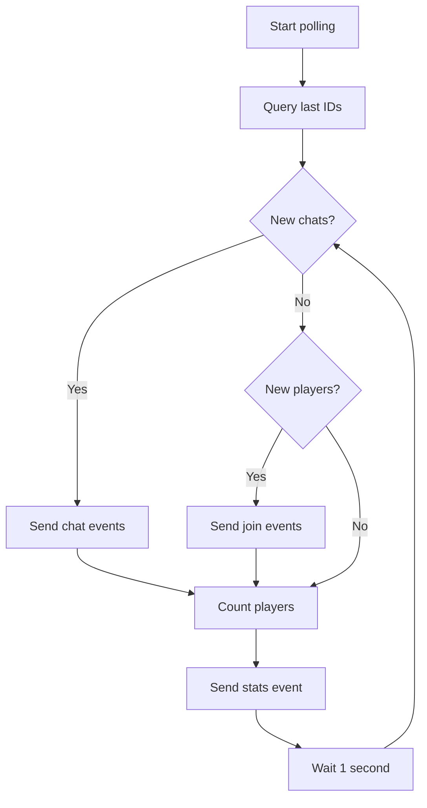
```mermaid
flowchart TD
    A[Start polling] --> B[Query last IDs]
    B --> C{New chats?}
    C -->|Yes| D[Send chat events]
    C -->|No| E{New players?}
    E -->|Yes| F[Send join events]
    E -->|No| G[Count players]
    D --> G
    F --> G
    G --> H[Send stats event]
    H --> I[Wait 1 second]
    I --> C
```

### Key Features

- **No WebSocket overhead**: Simple HTTP streaming
- **Automatic reconnection**: Browser handles reconnects
- **Incremental updates**: Only new data sent (tracked by `lastChatId`, `lastPlayerId`)
- **Low latency**: 1-second polling interval
- **Graceful cleanup**: Clears interval on connection abort

### Key Files

- [`src/app/(platform)/api/events/route.ts`](<file:///Users/ChukwukaUba/Desktop/waffles/frontend/src/app/(platform)/api/events/route.ts>) - SSE endpoint
- [`src/hooks/useGameEvents.ts`](file:///Users/ChukwukaUba/Desktop/waffles/frontend/src/hooks/useGameEvents.ts) - Client hook

---

## Reward System Flow

### Overview

Rewards are distributed when invitees participate in games. The system tracks reward status through three states.

### Reward Unlock Flow

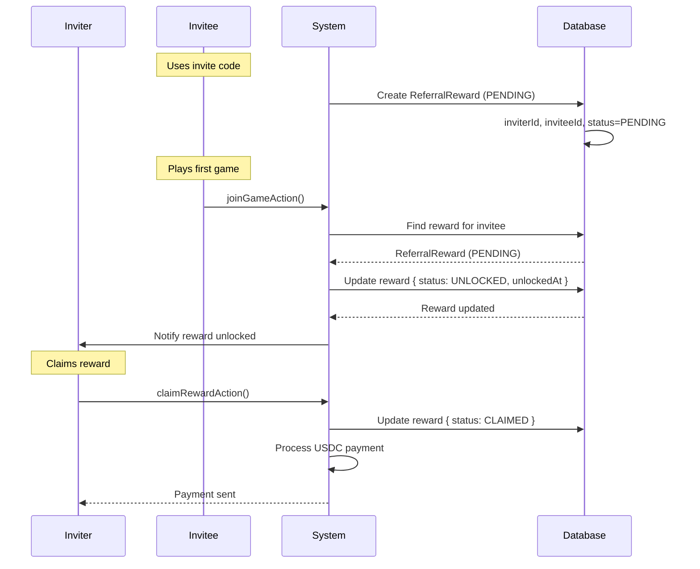
```mermaid
sequenceDiagram
    participant Inviter
    participant Invitee
    participant System
    participant DB as Database

    Note over Invitee: Uses invite code
    System->>DB: Create ReferralReward (PENDING)
    DB->>DB: inviterId, inviteeId, status=PENDING

    Note over Invitee: Plays first game
    Invitee->>System: joinGameAction()
    System->>DB: Find reward for invitee
    DB-->>System: ReferralReward (PENDING)

    System->>DB: Update reward { status: UNLOCKED, unlockedAt }
    DB-->>System: Reward updated

    System->>Inviter: Notify reward unlocked

    Note over Inviter: Claims reward
    Inviter->>System: claimRewardAction()
    System->>DB: Update reward { status: CLAIMED }
    System->>System: Process USDC payment
    System-->>Inviter: Payment sent
```

### Reward Calculation

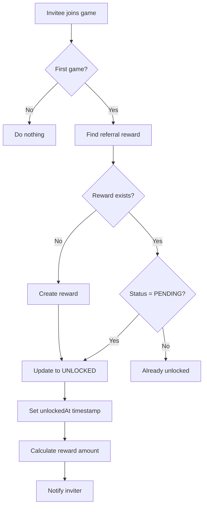
```mermaid
flowchart TD
    A[Invitee joins game] --> B{First game?}
    B -->|No| C[Do nothing]
    B -->|Yes| D[Find referral reward]
    D --> E{Reward exists?}
    E -->|No| F[Create reward]
    E -->|Yes| G{Status = PENDING?}
    G -->|Yes| H[Update to UNLOCKED]
    G -->|No| I[Already unlocked]
    F --> H
    H --> J[Set unlockedAt timestamp]
    J --> K[Calculate reward amount]
    K --> L[Notify inviter]
```

### Key Files

- [`src/actions/waitlist.ts`](file:///Users/ChukwukaUba/Desktop/waffles/frontend/src/actions/waitlist.ts) - Reward creation
- [`prisma/schema.prisma`](file:///Users/ChukwukaUba/Desktop/waffles/frontend/prisma/schema.prisma#L48-L59) - Reward model

---

## Database Schema Relationships

### Entity Relationship Diagram

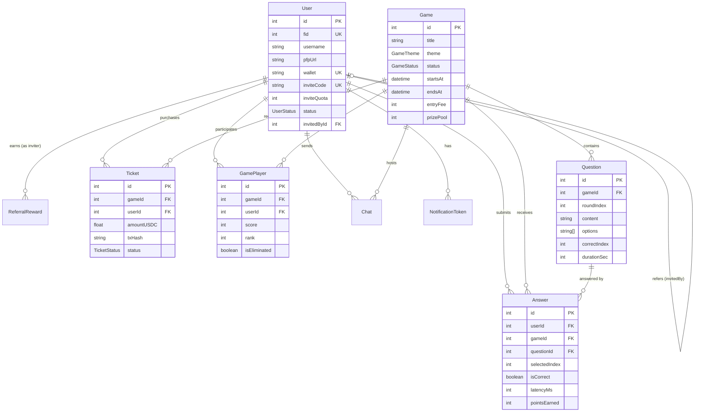
```mermaid
erDiagram
    User ||--o{ ReferralReward : "earns (as inviter)"
    User ||--o{ Ticket : "purchases"
    User ||--o{ GamePlayer : "participates"
    User ||--o{ Answer : "submits"
    User ||--o{ Chat : "sends"
    User ||--o{ NotificationToken : "has"
    User ||--o| User : "refers (invitedBy)"

    Game ||--o{ Question : "contains"
    Game ||--o{ Ticket : "requires"
    Game ||--o{ GamePlayer : "has"
    Game ||--o{ Answer : "receives"
    Game ||--o{ Chat : "hosts"

    Question ||--o{ Answer : "answered by"

    User {
        int id PK
        int fid UK
        string username
        string pfpUrl
        string wallet UK
        string inviteCode UK
        int inviteQuota
        UserStatus status
        int invitedById FK
    }

    Game {
        int id PK
        string title
        GameTheme theme
        GameStatus status
        datetime startsAt
        datetime endsAt
        int entryFee
        int prizePool
    }

    Question {
        int id PK
        int gameId FK
        int roundIndex
        string content
        string[] options
        int correctIndex
        int durationSec
    }

    Ticket {
        int id PK
        int gameId FK
        int userId FK
        float amountUSDC
        string txHash
        TicketStatus status
    }

    GamePlayer {
        int id PK
        int gameId FK
        int userId FK
        int score
        int rank
        boolean isEliminated
    }

    Answer {
        int id PK
        int userId FK
        int gameId FK
        int questionId FK
        int selectedIndex
        boolean isCorrect
        int latencyMs
        int pointsEarned
    }
```

### Critical Unique Constraints

```prisma
// One ticket per user per game
model Ticket {
  @@unique([gameId, userId])
}

// One participation record per user per game
model GamePlayer {
  @@unique([gameId, userId])
}

// One answer per user per question (can be updated)
model Answer {
  @@unique([userId, questionId])
}

// One reward per invitee
model ReferralReward {
  inviteeId Int @unique
}
```

### Important Indexes

```prisma
// Fast game lookups by status and timing
model Game {
  @@index([status, startsAt])
}

// Fast leaderboard queries
model GamePlayer {
  @@index([gameId, score(sort: Desc)])
}

// Fast question lookups by round
model Question {
  @@index([gameId, roundIndex])
}

// Fast chat history loading
model Chat {
  @@index([gameId, createdAt])
}

// Fast answer lookups for scoring
model Answer {
  @@index([gameId, userId])
}
```

---

## Summary

This documentation covers all major flows in the Waffles application:

1. **User Onboarding** - Farcaster auth → Account creation → Invite code generation
2. **Referral System** - Invite sharing → Code redemption → Reward distribution
3. **Game Lifecycle** - SCHEDULED → LIVE → ENDED states
4. **Ticket Purchase** - USDC payment → Idempotent ticket creation → PAID state
5. **Game Join** - Ticket redemption → GamePlayer creation → Lobby entry
6. **Live Gameplay** - Question answering → Score calculation → Leaderboard updates
7. **Real-Time Events** - SSE polling → Chat/join events → Statistics streaming
8. **Reward System** - PENDING → UNLOCKED → CLAIMED progression

All flows are designed for:

- **Idempotency**: Safe retries and duplicate prevention
- **Atomicity**: Database transactions for consistency
- **Real-time**: Live updates via SSE
- **Security**: Authentication checks on all mutations
- **Scalability**: Efficient indexes and queries

For implementation details, refer to the linked source files in each section.
