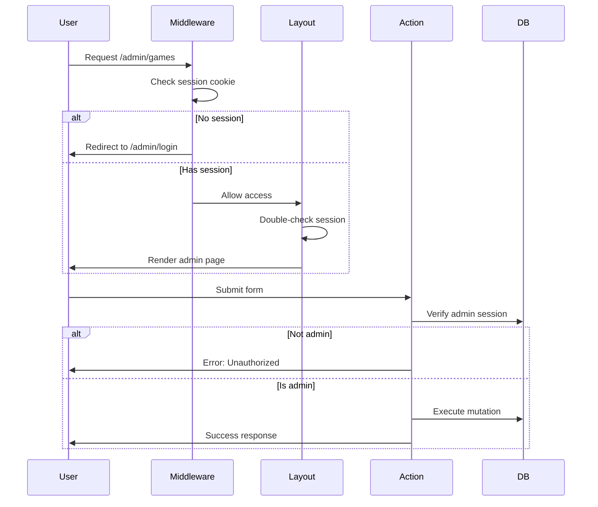

# Architecture

## System Architecture

The admin dashboard follows a modern, server-first architecture leveraging Next.js App Router capabilities.

```mermaid
graph TB
    Client[Browser Client]
    Middleware[Edge Middleware]
    Layout[Admin Layout]
    Pages[Admin Pages RSC]
    Actions[Server Actions]
    Prisma[Prisma ORM]
    DB[(PostgreSQL)]
    Blob[Vercel Blob]

    Client -->|HTTP Request| Middleware
    Middleware -->|Auth Check| Layout
    Layout -->|Render| Pages
    Pages -->|Mutations| Actions
    Actions -->|Query/Update| Prisma
    Prisma -->|SQL| DB
    Client -->|Direct Upload| Blob
    Blob -->|Auth Token| Middleware
</mermaid>

## Directory Structure

```

src/
├── app/
│ └── admin/
│ ├── layout.tsx # Admin layout with auth
│ ├── page.tsx # Dashboard home
│ ├── games/
│ │ ├── page.tsx # Games list
│ │ ├── loading.tsx # Skeleton state
│ │ ├── create/
│ │ │ └── page.tsx # Create game
│ │ └── [id]/
│ │ ├── edit/
│ │ │ └── page.tsx # Edit game
│ │ └── questions/
│ │ └── page.tsx # Manage questions
│ ├── users/
│ │ ├── page.tsx # Users list
│ │ ├── loading.tsx # Skeleton state
│ │ └── [id]/
│ │ └── page.tsx # User details
│ ├── analytics/
│ │ └── page.tsx # Analytics dashboard
│ ├── tickets/
│ │ └── page.tsx # Ticket management
│ ├── logs/
│ │ └── page.tsx # Audit logs
│ └── settings/
│ └── page.tsx # System settings
├── components/
│ └── admin/
│ ├── Sidebar.tsx # Navigation sidebar
│ ├── GameForm.tsx # Game creation/edit
│ ├── GameActions.tsx # Game action dropdown
│ ├── QuestionForm.tsx # Question creation
│ ├── MediaUpload.tsx # File upload component
│ ├── StatsCard.tsx # Dashboard stat card
│ └── DashboardCharts.tsx # Analytics charts
├── actions/
│ └── admin/
│ ├── games.ts # Game server actions
│ ├── questions.ts # Question server actions
│ └── users.ts # User server actions
└── lib/
├── admin-auth.ts # Admin authentication
├── audit.ts # Audit logging
└── db.ts # Prisma client

````

## Component Architecture

### Server Components (RSC)

Most admin pages are Server Components for optimal performance:

```tsx
// src/app/admin/games/page.tsx
export default async function GamesListPage({ searchParams }) {
  // Direct database access on server
  const games = await prisma.game.findMany({ ... });

  return (
    <div>
      {games.map(game => <GameRow game={game} />)}
    </div>
  );
}
````

**Benefits**:

- Direct database access (no API layer needed)
- Automatic request deduplication
- Reduced client bundle size
- SEO-friendly (fully rendered HTML)

### Client Components

Interactive components use `"use client"`:

```tsx
// src/components/admin/GameActions.tsx
"use client";

export function GameActions({ game }) {
  const [isOpen, setIsOpen] = useState(false);
  // Client-side interactivity
}
```

**Use Cases**:

- User interactions (clicks, forms)
- State management (dropdowns, modals)
- Browser APIs (localStorage, etc.)

## Data Flow

### Read Path (Server Components)

```
User navigates → RSC renders → Prisma query → PostgreSQL → HTML response
```

- Zero client-side data fetching
- No loading spinners (uses Suspense)
- Automatic caching and revalidation

### Write Path (Server Actions)

```
User submits form → Server Action → Validation → Prisma mutation → revalidatePath → Re-render
```

Example:

```tsx
// actions/admin/games.ts
export async function createGameAction(formData: FormData) {
  // 1. Validate auth
  const session = await requireAdminSession();

  // 2. Validate data
  const data = gameSchema.parse(formData);

  // 3. Database mutation
  await prisma.game.create({ data });

  // 4. Revalidate cache
  revalidatePath('/admin/games');

  // 5. Audit log
  await logAdminAction({ ... });
}
```

## Authentication Flow



## Database Schema Design

### Core Models

```prisma
model User {
  id       Int     @id @default(autoincrement())
  fid      String  @unique
  username String?
  role     UserRole @default(USER)
  status   UserStatus @default(ACTIVE)

  // Relationships
  tickets       Ticket[]
  gamePlayers   GamePlayer[]
  auditLogs     AuditLog[]
}

model Game {
  id          Int        @id @default(autoincrement())
  title       String
  description String?
  theme       GameTheme
  status      GameStatus @default(SCHEDULED)
  coverUrl    String?    // Media upload

  // Configuration
  startsAt         DateTime
  endsAt           DateTime
  entryFee         Int
  prizePool        Int
  roundDurationSec Int
  questionCount    Int

  // Relationships
  questions Question[]
  players   GamePlayer[]
  tickets   Ticket[]
}

model Question {
  id           Int      @id @default(autoincrement())
  gameId       Int
  roundIndex   Int
  content      String
  mediaUrl     String?  // Image/video
  soundUrl     String?  // Audio
  options      String[]
  correctIndex Int
  durationSec  Int

  // Relationships
  game    Game     @relation(fields: [gameId], references: [id])
  answers Answer[]
}
```

### Audit Model

```prisma
model AuditLog {
  id         Int        @id @default(autoincrement())
  adminId    Int
  action     AdminAction
  entityType EntityType
  entityId   Int
  details    Json?
  createdAt  DateTime   @default(now())

  admin User @relation(fields: [adminId], references: [id])
}
```

## Caching Strategy

### Static Pages

- Login page: Static (pre-rendered)
- Public pages: ISR (Incremental Static Regeneration)

### Dynamic Pages

- All admin pages: Dynamic (force-dynamic)
- Real-time data requirements
- User-specific content

### Revalidation

- `revalidatePath()` after mutations
- Granular cache invalidation
- No full-page reloads needed

## Security Layers

### Layer 1: Edge Middleware

```tsx
// middleware.ts
export function middleware(request: NextRequest) {
  if (request.nextUrl.pathname.startsWith("/admin")) {
    const session = getSessionFromCookie(request.cookies);
    if (!session) {
      return NextResponse.redirect("/admin/login");
    }
  }
}
```

### Layer 2: Layout Check

```tsx
// app/admin/layout.tsx
export default async function AdminLayout({ children }) {
  const session = await getAdminSession();
  if (!session) redirect("/admin/login");
  return <AdminUI>{children}</AdminUI>;
}
```

### Layer 3: Server Action Validation

```tsx
// actions/admin/games.ts
export async function createGameAction() {
  const { authenticated, session } = await requireAdminSession();
  if (!authenticated) {
    return { success: false, error: "Unauthorized" };
  }
  // ... proceed with mutation
}
```

## Performance Optimizations

### 1. Database Indexing

```prisma
@@index([status, startsAt])  // Fast game queries
@@index([gameId, roundIndex]) // Fast question lookups
@@index([createdAt])          // Fast audit log queries
```

### 2. Query Optimization

- Use `select` to limit fields
- Include only needed relations
- Paginate large result sets

### 3. Component Loading

- Skeleton states for perceived performance
- Suspense boundaries for streaming
- Loading.tsx for automatic loading UI

### 4. Asset Optimization

- Direct CDN uploads (Vercel Blob)
- Image optimization (Next.js Image)
- Code splitting (automatic)

## Scalability Considerations

### Horizontal Scaling

- Stateless design (session in cookies)
- Edge middleware (deployed globally)
- CDN for static assets

### Vertical Scaling

- Connection pooling (Prisma)
- Efficient queries (limited joins)
- Indexed lookups

## Monitoring

### Built-in Monitoring

- Audit logs for all admin actions
- Error logs viewer
- Database health checks
- Active game monitoring

### External Monitoring (Recommended)

- Vercel Analytics for performance
- Sentry for error tracking
- Database monitoring tools

## Next Steps

- [Feature Documentation](./03-features.md)
- [API Reference](./05-api-reference.md)
- [Security Guide](./06-security.md)
